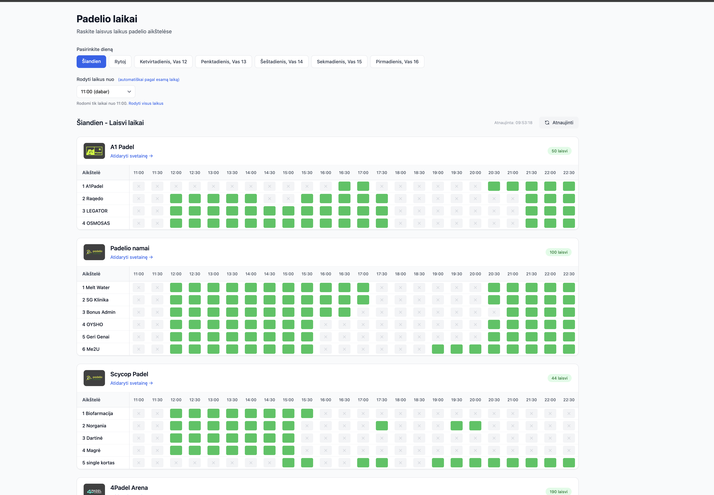
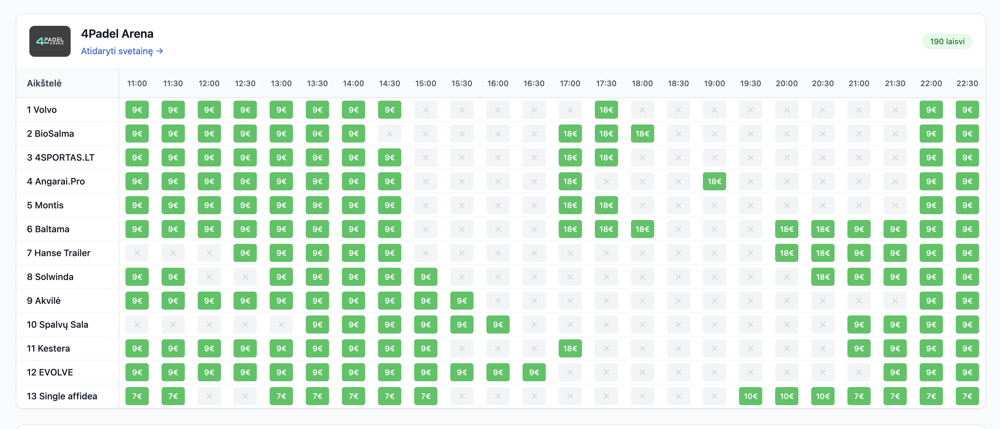
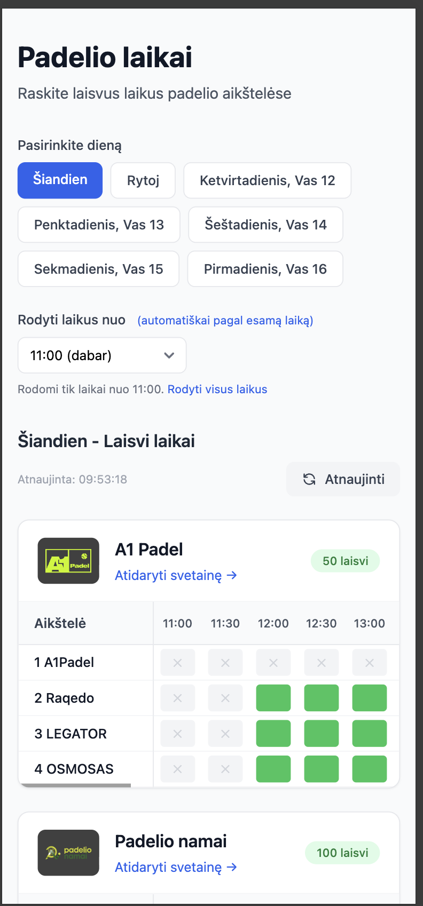

# Padel Time

A single-page aggregator for padel court availability across multiple venues in Lithuania. Pick a date, see free slots and prices in one place instead of opening several booking sites.

---

## What problem it solves

Booking a padel court usually means checking 4Padel, Padel Spot, Skycop, and others one by one. Different UIs, different flows, no way to compare. This app:

-   **Aggregates** availability from several venues into one table per date.
-   **Filters** by “from this time” (e.g. show only slots from 18:00).
-   **Shows prices** where the source provides them (e.g. 4Padel, Padel Spot).
-   **Uses Lithuania time** so “today” and “from current hour” match local time even when the server runs in UTC.

The UI is in Lithuanian and aimed at local use.

---

## How it’s built

### Stack

-   **Backend:** FastAPI, Python 3.12+
-   **Scraping:** httpx, BeautifulSoup, lxml (mix of HTML scraping and JSON APIs)
-   **Templates:** Jinja2, Tailwind CSS, Flowbite
-   **Cache:** in-memory TTL cache (e.g. 10 min) to limit repeated requests to venue sites
-   **Deploy:** Docker, GitHub Actions → Coolify webhook

### Architecture

-   **Scrapers** live under `scrapers/`. Each venue has a small module that implements `BaseScraper`: fetch data for a date and return a `CourtAvailability` (venue name, URL, list of `TimeSlot`s with time, court, optional price). Scrapers are registered via a decorator; the registry runs them concurrently and handles caching.
-   **App** (`main.py`) has a single main route: date (and optional “from” time) as query params, then `scraper_registry.scrape_all(date)`, filter by time, build a per-venue table (courts × 30‑min columns, green = free, optional price in cell). Same data is exposed as JSON under `/api/availability` for optional reuse.
-   **Abuse control:** refresh and “change date” are rate-limited per IP (e.g. N actions per 5 minutes). Date is only allowed for “today” through “today + 6 days”. If the user switches to a date that’s already in cache, that navigation doesn’t count toward the limit so normal browsing isn’t punished.
-   **Timezone:** server uses `Europe/Vilnius` for “current hour” and “today” so behaviour is correct for Lithuania regardless of server TZ.

### Project layout

```
├── main.py                 # FastAPI app, routes, rate limit, time filter
├── scrapers/
│   ├── base.py             # TimeSlot, CourtAvailability, BaseScraper
│   ├── registry.py         # ScraperRegistry, TTL cache, concurrent scrape_all
│   ├── fourpadel_scraper.py
│   ├── padelspot_scraper.py
│   └── ...                 # one module per venue (API or HTML)
├── templates/              # Jinja2 + Tailwind
│   ├── layout.html
│   ├── index.html
│   └── partials/_venue_table.html
├── static/
├── docs/screenshots/       # Screenshots for this README
├── Dockerfile
└── docker-compose.yml
```

---

## Screenshots

| Description                              | Screenshot                                              |
| ---------------------------------------- | ------------------------------------------------------- |
| Main view — date picker and venue tables |                  |
| Venue table detail                       |  |
| Mobile                                   |                   |

---

## Gotchas and trade-offs

-   **Scrapers are brittle:** venue sites or APIs change; a scraper can break and the app shows an error for that venue. Adding a new venue means a new scraper and possibly different parsing (HTML vs JSON).
-   **No auth:** the app is read-only and doesn’t log into booking systems. It only shows “free at this time”; actual booking is still on the venue’s site.
-   **Rate limit is in-memory:** with a single process it’s per-IP and works. Multiple instances would need a shared store (e.g. Redis) for a single limit across replicas.
-   **Cache is in-memory:** same as above; restart clears cache. Fine for a single-instance deploy.
-   **Timezone:** hardcoded to `Europe/Vilnius`. Supporting more regions would mean configurable timezone or user preference.

---

## Running it

Docker is the intended way to run the app (locally or on a VPS). See `Dockerfile` and `docker-compose.yml`; no detailed installation steps are in this README.


You can check live version of the app here: https://padeliolaikas.lt/ (Deployed with Coolify on my own VPS).

---

## License

Private / portfolio project. All rights reserved unless stated otherwise.
